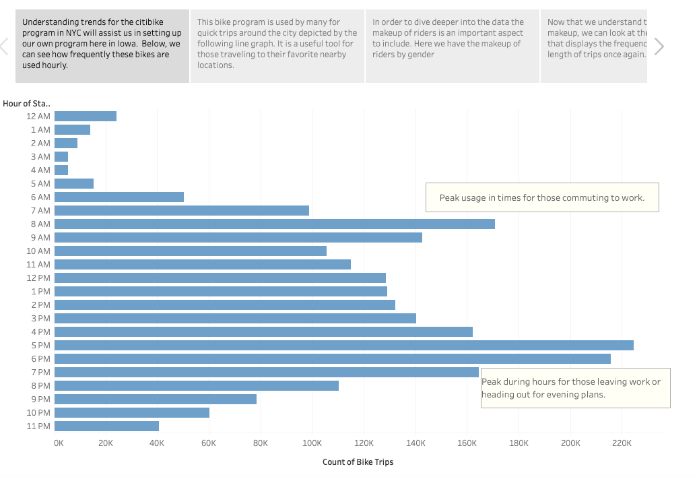
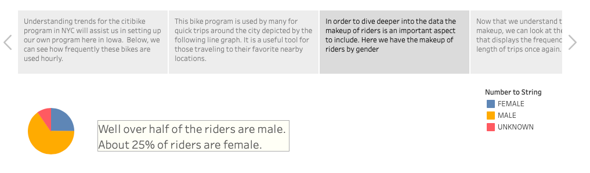
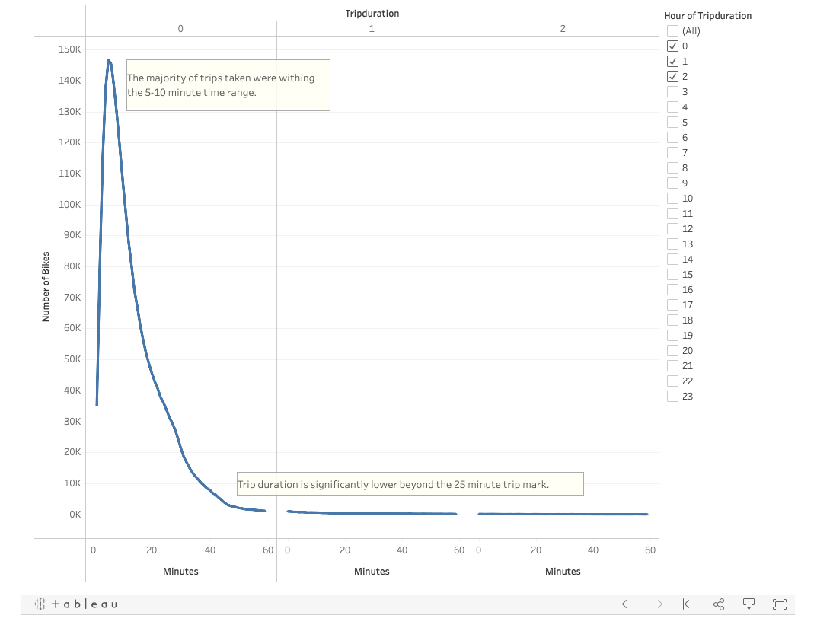
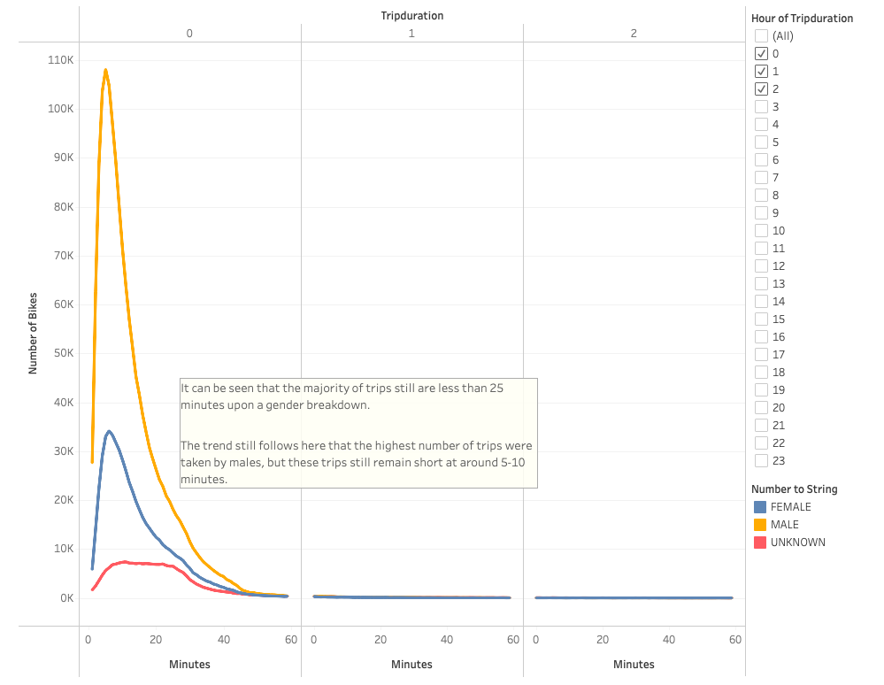
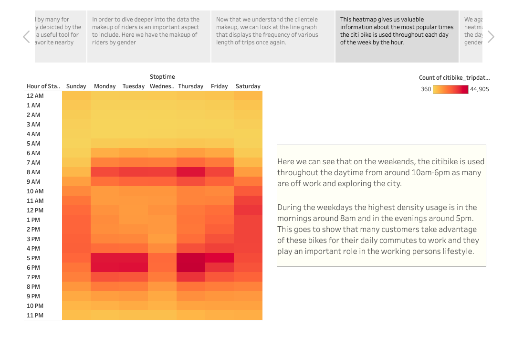
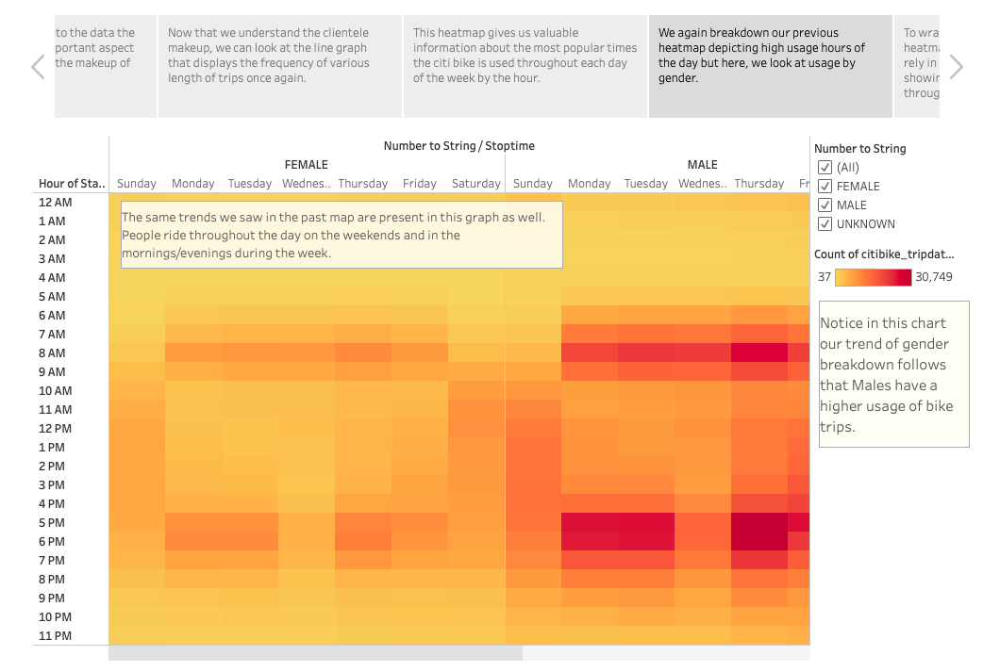
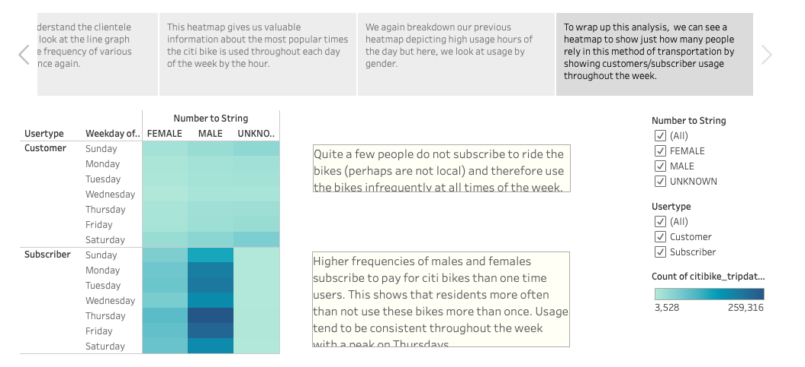

# Bikesharing
[Link to Tableau Story](https://public.tableau.com/app/profile/chloe.geisel/viz/BikesharingChallenge_16369883930100/BikeTripAnalysis?publish=yes)

## Overview of the analysis
We are interested in creating a bikesharing business in Des Moines, Iowa after seeing how successful the citibike program ran in New York City. In order to get funding from Investors dynamic visualizations are created in Tableau using data from NYC to:
- Show the length of time that bikes are checked out for all riders and genders
- Show the number of bike trips for all riders and genders for each hour of each day of the week
- Show the number of bike trips for each type of user and gender for each day of the week.

These visualizations of the New York business will convince investors that it would be a beneficial program in our city as well. 

## Results
The visualizations created in the Tableau story help to paint a picture of how this program worked in NYC. 

1. Here we begin our story by showing the frequency of the pages used by each hour.

2. It's also important for our visualizations to understand the makeup of the customers in this city.

3. Here we can see the length of time that bikes tend to be checked out for and it can be seen that short trips are most often taken. 

4. If the trip duration is broken down by gender it can still be seen that short trips are most often taken. 

5. A visualization is also made to show the most popular times of the day throughout the week to use a citibike. 

6. Upon breaking down the previous visualization by gender, the trend still follows that weekends the bikes are used all day, and bikes are used on the weekdays in the mornings/evenings. 

7. Here we break down our fifth visualization once again but instead look at the most frequented hours of the week based on whether or not people are subscribers to the citibike program. 

These visualizations show how successful and necessary this program has been and will asssist in showing investors what an important asset this business could be. 

## Summary
Provide a high-level summary of the results and two additional visualizations that you would perform with the given dataset.
